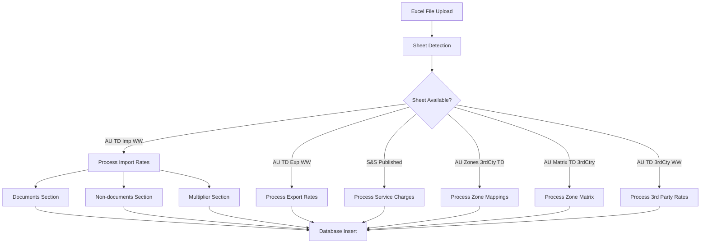

# DHL Express Excel Sheet Processing Logic

## **Automatic Sheet Detection & Processing**

The system uses sophisticated logic to automatically detect and process specific Excel sheet tabs. Here's exactly how it works:

## **1. Sheet Detection Process**

### **Main Rate Cards Loader** (`improved_dhl_express_rate_card_loader.py`)

```python
# Step 1: Open Excel file and get all sheet names
excel_file = pd.ExcelFile(excel_path)
print(f"Available sheets: {excel_file.sheet_names}")

# Step 2: Check for specific sheet names and process accordingly
if 'AU TD Imp WW' in excel_file.sheet_names:
    import_count = self._load_service_rates(excel_path, 'AU TD Imp WW', 'Import')
    
if 'AU TD Exp WW' in excel_file.sheet_names:
    export_count = self._load_service_rates(excel_path, 'AU TD Exp WW', 'Export')

# Step 3: Look for service charges (with fallback logic)
if 'S&S Published' in excel_file.sheet_names:
    service_charges_count = self._load_service_charges(excel_path)
```

### **3rd Party Loader** (`complete_3rd_party_loader.py`)

```python
# Hardcoded sheet name targeting
df = pd.read_excel(excel_path, sheet_name='AU Zones 3rdCty TD')    # Zone mappings
df = pd.read_excel(excel_path, sheet_name='AU Matrix TD 3rdCtry')  # Zone matrix
df = pd.read_excel(excel_path, sheet_name='AU TD 3rdCty WW')       # 3rd party rates
```

## **2. Sheet-to-Table Mapping Logic**

### **Import/Export Rate Processing**

| Excel Sheet | Target Table | Processing Method | Data Sections |
|-------------|--------------|-------------------|---------------|
| `AU TD Imp WW` | `dhl_express_rate_cards` | `_load_service_rates()` | Documents, Non-docs, Multiplier |
| `AU TD Exp WW` | `dhl_express_rate_cards` | `_load_service_rates()` | Documents, Non-docs, Multiplier |

**Processing Logic:**
```python
def _load_service_rates(self, excel_path: str, sheet_name: str, service_type: str):
    df = pd.read_excel(excel_path, sheet_name=sheet_name, header=None)
    
    # Section 1: Documents (0.5-2kg)
    section1_count = self._load_documents_section(df, service_type)
    
    # Section 2: Non-documents (0.5-30kg) 
    section2_count = self._load_non_documents_section_improved(df, service_type)
    
    # Section 3: Multiplier rates (30kg+)
    section3_count = self._load_multiplier_section_improved(df, service_type)
```

### **Service Charges Processing**

| Excel Sheet | Target Table | Processing Method | Content Type |
|-------------|--------------|-------------------|--------------|
| `S&S Published` | `dhl_express_services_surcharges` | `_load_service_charges()` | Service codes & charges |

**Processing Logic:**
```python
def _load_service_charges(self, excel_path: str):
    # Try demerged file first (preprocessed)
    demerged_path = excel_path.replace('.xlsx', '_demerged.xlsx')
    if os.path.exists(demerged_path):
        df = pd.read_excel(demerged_path, sheet_name='Services_Demerged')
    else:
        # Fallback to original S&S Published sheet
        df = pd.read_excel(excel_path, sheet_name='S&S Published')
    
    # Parse service codes and charges
    for idx, row in df.iterrows():
        service_code = str(row.iloc[0]).strip()
        service_name = str(row.iloc[1]).strip()
        # Extract AUD amounts using regex
        charge_match = re.search(r'(\d+\.?\d*)\s*AUD', charge_info)
```

### **3rd Party Data Processing**

| Excel Sheet | Target Table | Processing Method | Content Type |
|-------------|--------------|-------------------|--------------|
| `AU Zones 3rdCty TD` | `dhl_express_3rd_party_zones` | `load_zone_mappings()` | Country → Zone mapping |
| `AU Matrix TD 3rdCtry` | `dhl_express_3rd_party_matrix` | `load_matrix_data()` | Zone × Zone → Rate Zone |
| `AU TD 3rdCty WW` | `dhl_express_3rd_party_rates` | `load_rate_data()` | Weight → Zone rates |

## **3. Data Section Detection Within Sheets**

### **Rate Card Section Detection**

Each Import/Export sheet contains multiple rate sections. The system finds them by:

```python
# Look for section headers
for idx, row in df.iterrows():
    if pd.notna(row[0]) and "Documents up to 2.0" in str(row[0]):
        doc_section_row = idx
        
    if pd.notna(row[0]) and "Non-documents" in str(row[0]):
        non_doc_section_row = idx
        
    if pd.notna(row[0]) and "Multiplier rate" in str(row[0]):
        multiplier_section_row = idx
```

### **Weight Range Detection**

```python
# Documents section: 0.5, 1.0, 1.5, 2.0 kg
doc_weights = [0.5, 1.0, 1.5, 2.0]

# Non-documents: 0.5kg increments from 0.5 to 30kg
weights = [round(w * 0.5, 1) for w in range(1, 61)]  # 0.5 to 30.0

# Multiplier section: Extract weight ranges from Excel
for weight_range in weight_ranges:
    weight_from, weight_to = parse_weight_range(weight_range)
```

### **Zone Column Detection**

```python
# Import/Export: Zones 1-9 (columns 2-10)
for zone_col in range(2, 11):  # Zones 1-9
    rate = float(row_data[zone_col]) if pd.notna(row_data[zone_col]) else None
    zone_rates.append(rate)

# 3rd Party: Zones A-H (columns vary by sheet structure)
zone_letters = ['A', 'B', 'C', 'D', 'E', 'F', 'G', 'H']
```

## **4. Error Handling & Fallbacks**

### **Missing Sheet Handling**

```python
if 'AU TD Imp WW' in excel_file.sheet_names:
    # Process Import rates
else:
    print("⚠️  Import sheet not found - skipping Import rates")

if 'S&S Published' in excel_file.sheet_names:
    # Process service charges
else:
    print("⚠️  Service charges sheet not found - skipping")
```

### **Data Validation**

```python
# Validate numeric values
try:
    rate = float(row_data[zone_col]) if pd.notna(row_data[zone_col]) else None
except (ValueError, TypeError):
    rate = None

# Validate weight ranges
if weight_from and weight_to and weight_from <= weight_to:
    # Valid weight range
else:
    print(f"⚠️  Invalid weight range: {weight_from}-{weight_to}")
```

## **5. Processing Workflow Summary**



## **6. Key Features**

### **Automatic Section Recognition**
- Finds rate sections by text pattern matching
- Handles merged cells and irregular formatting
- Supports multiple weight ranges and zone structures

### **Flexible Sheet Naming**
- Exact match required for sheet names
- Case-sensitive sheet detection
- Fallback handling for missing sheets

### **Data Validation**
- Type checking for numeric values
- Weight range validation
- Zone mapping verification

### **Multi-Table Population**
- Single upload populates multiple database tables
- Maintains data relationships between tables
- Atomic operations with rollback on errors

## **7. Complete Processing Command**

```bash
# Upload via Web Interface
POST http://127.0.0.1:5000/dhl-express/upload
# File: your_rate_card.xlsx

# Processing happens automatically:
# 1. Sheet detection
# 2. Section parsing
# 3. Data extraction
# 4. Database population
# 5. Validation & verification
```

The system is designed to handle variations in Excel file structure while maintaining robust data extraction and validation.
